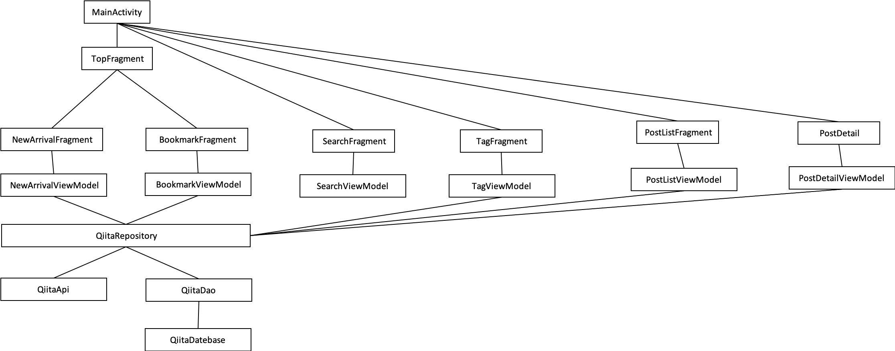

## パッケージ構成

- presentation
    - View, ViewModel、widget、adapter等
- data
    - repository
    - api
    - db
- domain
    - model

## クラス図

Item, Tag, User等が抜けてました。。

## DBテーブル

|カラム名|属性|備考|
|:--|:--|:--|
|id|varchar|記事のid, PK|
|register_time|datetime|-|

※ 一覧の表示に必要な情報もテーブルに追加する(title, user_icon, user_name, tag等)

## 利用ライブラリ
### AAC
- navigation
- coroutine

### DB
- room

### httpクライアント
- retrofit

### Jsonパース
- kotshi

### DI
- dagger hilt

### 画像
- Glide

### 日付
- ThreeTenABP
